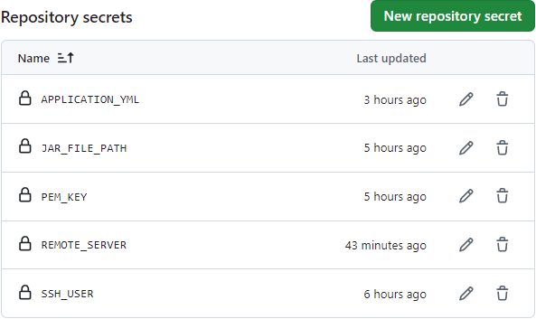
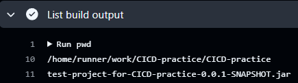
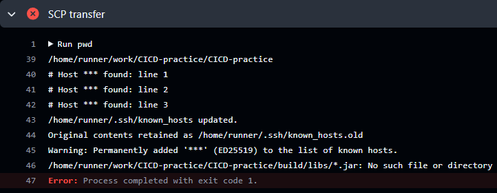
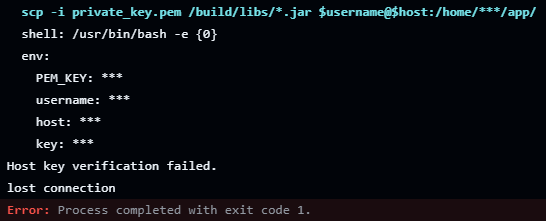

이 레포지토리는 CICD를 연습하며 만든 레포지토리이다. 

레포지토리에 코드를 올린 후, main에 PR하여 Github Actions 트리거가 작동하여 CICD가 시작된다.

전체 workflow는 아래의 링크를 통해 볼 수 있다.
https://github.com/RiverCastle/CICD-practice/blob/main/.github/workflows/CICD.yml

---

사용방법:
1. 위의 링크로 이동하여, 해당 내용을 복사한다.
2. 프로젝트 루트 디렉토리로 이동하여 .github/workflows/로 이동 후, 해당 내용을 붙여넣어 yml 파일을 생성한다.
3. 서버 인스턴스를 생성한다.
4. 레포지토리 이동 - Settings 이동 - (Security) Secrets and Variables 의 Actions로 이동한다.
5. Repository secret 섹션에 비밀 환경변수를 등록한다. 



* workflow 파일 내의 환경변수명과 일치해야 합니다.
* REMOTE_SERVER는 서버의 퍼블릭 IP입니다.
* application.yml 파일의 경우, 반드시 base 64로 endcode 해야합니다.
* https://www.base64encode.org/


---

직접 부딪힌 문제를 해결하며 깨달은 주요 포인트 1. 인스턴스 분리


Github Actions는 여러 Job으로 구성되며 각 Job은 각 Instance를 통해 수행된다. 그 때문에 Job1의 자원을 Job2에서 쉽게 사용할 수 없다. (가능하기는 하지만 자원이 연결/의존되는 경우 그냥 하나의 job으로 구성하는 것이 이로운 듯 하다.)

위의 사실을 크게 깨닫게 된 과정은 다음과 같다. 위의 사실을 모른 채, 이 workflow는 초기에 build job과 tranfer & run job으로 나눠서 구성하였다. 


빌드 성공, jar 파일 전송 실패 



빌드 성공, jar 파일 생성 확인



scp를 통한 jar 파일 전송 실패 및 에러 메시지

그 결과, 위와 같이 빌드는 잘 되었고, jar 파일이 생성된 것까지 확인했으나, transfer 하려는 시점에서 해당 파일이 없다는 에러 메시지와 함께 수 차례 실패를 경험했다. 해결을 위해 이전에 사용했던 workflow를 참고했고, 하나의 job으로 했던 것에 착안하여 다시 작성함으로써 해결할 수 있었다. 

사실 꼭 하나의 job으로 작성하는 것만이 해결하는 방법은 아니다. Github Actions에 파일 업로드 아티팩트(actions/upload-artifact@v2), 파일 다운로드 아티팩트(actions/download-artifact@v2)를 사용하여 jar 파일을 업로드하고, transfer를 할 인스턴스에서 jar 파일을 다운로드받아 사용하면 된다. 

---

직접 부딪힌 문제를 해결하며 깨달은 주요 포인트 2. 호스트 키

이 workflow를 작성하기 전에 git bash를 열어 해당 스크립트를 꼭 먼저 실행해보면서 작성하였다. 예시 스크립트는 다음과 같다.

``
    scp -i [pem key file] [target-file] [ec2-user]@[ec2-public-ip]:[target-path]
``

이 스크립트를 로컬에서 실행시킬 때는 의도한대로 파일이 성공적으로 전송되었으나, Github Actions에서 스크립트가 실행될 때는 다음과 같이 실패하였다.



이 문제를 임시적으로 해결하려면, 아래와 같이 scp 옵션을 추가하면 된다. 호스트 키를 업격하게 검사하지 않겠다는 옵션이다. 하지만, 이는 권장되는 방법이 아니다.

``
scp -o StrictHostKeyChecking=no -i [pem key file] [target-file] [ec2-user]@[ec2-public-ip]:[target-path]
``

대신, 아래와 같은 스크립트를 통해 호스트의 ssh 공개키를 등록할 수 있다. 

````
- name: Add EC2 Host Key
    env:
        host: ${{ secrets.REMOTE_SERVER }}
        PEM_KEY: ${{ secrets.PEM_KEY}}
    run: |
        mkdir -p ~/.ssh
        echo "$PEM_KEY" > ~/.ssh/id_rsa
        chmod 600 ~/.ssh/id_rsa
        ssh-keyscan -H $host >> ~/.ssh/known_hosts    
````

(정확하게 파악한 것은 아닐수도 있지만,) 이러한 절차가 필요한 것은 서버에 대한 신뢰성때문이라고 이해했다. Github Actions의 인스턴스를 통해 접속하려는 서버가 접속해도 되는 서버인지, 중간에 해커가 목적지 서버를 변경헀을 수도 있기 때문에 이러한 인증과정이 필요하다. 
모든 작업을 마친 후에는 아래와 같이 공개키를 제거하면 된다.

`
ssh-keygen -R $host
`

---
